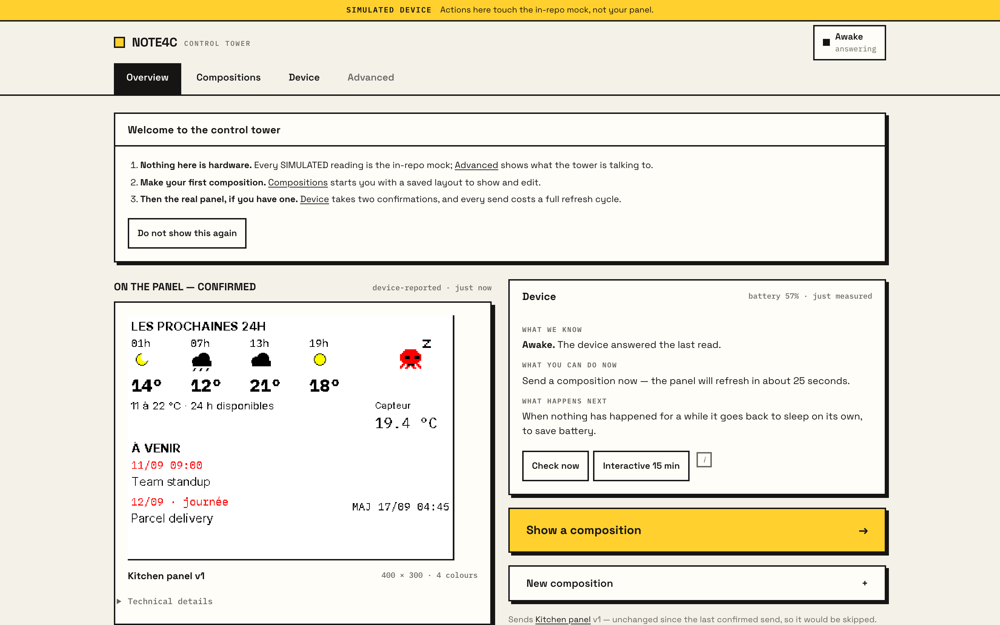

# NOTE4C Control Tower

A local, paper-styled web app for the NOTE4C e-paper devkit: design a dashboard,
see exactly what would be painted, push it, and read back what the device
actually says happened.

It runs on your machine, binds loopback, and talks to the panel on your LAN. It
is an **unofficial** companion for the NOTE4C devkit — not affiliated with,
endorsed by, or supported by its vendor.



More, including the designer and the device page, in [`docs/images/`](docs/images).
They are regenerated by `npm run screenshots`, which drives a throwaway tower
against the mock with fixture data — nothing on them is a fact about the
machine that made them.

## Why it exists, and what it refuses to do

E-paper is frozen ink. A number that is wrong sits on the wall looking
authoritative for hours, and a device that runs on a battery is asleep most of
the time — so most of what a control panel for it would like to tell you, it
cannot actually know. Everything here follows from taking that seriously:

- **The preview is the renderer.** The designer runs the same TypeScript that
  packs the bytes for the device, painting palette indices to a canvas with
  nearest-neighbour scaling. There is no second, prettier preview to disagree
  with the panel.
- **Missing data is drawn, not hidden.** Every module is handed
  `{state, value?, observedAt?}` and renders its own explicit unavailable or
  stale state. Nothing falls back to a zero.
- **"Displayed" means the device said so.** Digests the device reports are
  mapped back to dashboard versions through an append-only ledger. A digest
  with no ledger entry is labelled an unknown frame rather than guessed at.
- **An unknown outcome stays unknown.** A push whose confirmation never
  arrives is `uncertain` — not failed, not succeeded. It blocks later pushes
  until you re-check the device or explicitly acknowledge it, and the
  acknowledgement is recorded as a person accepting an unknown outcome.
- **There is no "wake the device" button.** Deep sleep powers the radio down;
  no packet can change that. A request aimed at a sleeping device becomes a
  recorded *intent*, shown as pending, delivered when the device next wakes.
  The button on the device is the only immediate wake there is, and the
  interface says so where that button would have been.

## Quick start, on the simulated device

You do not need the hardware to try it. A faithful in-repo mock speaks the same
HTTP contract, and every device-derived reading is labelled `SIMULATED` while
it is in use.

```bash
npm install
npm run dev          # http://localhost:8654
```

`npm run dev` and `npm start` both go through `tools/tower-serve.ts`, which
applies the bind policy before Next starts. With nothing configured that is
`localhost`; a host it refuses means the command exits and no socket is opened.
See "Network behaviour" below.

The first run asks you to set a tower passphrase. It protects the device token
and every push, and the server refuses to bind anything but loopback until one
exists. Then: create a dashboard, drag a tile, press Push.

The ten-minute version, with screenshots, is **[QUICKSTART.md](QUICKSTART.md)**.
The real-device procedure is the second half of the same document.

## Documentation

| Document | What is in it |
| --- | --- |
| [QUICKSTART.md](QUICKSTART.md) | Ten minutes on the mock, then the real panel |
| [docs/ARCHITECTURE.md](docs/ARCHITECTURE.md) | How a pixel gets from a source to the panel |
| [docs/COMPATIBILITY.md](docs/COMPATIBILITY.md) | Which devices and firmware levels this targets |
| [CONTRIBUTING.md](CONTRIBUTING.md) | Development setup, the test gates, the house style |
| [SECURITY.md](SECURITY.md) | Threat model and how to report something privately |
| [NOTICE](NOTICE) | Fonts, licences, attributions, outbound services |

## Configuration

Everything about *your* machine is an environment variable, and nothing is
assumed. A tower with no configuration runs against the mock, reports every
unconfigured source as "not configured" rather than broken, and fetches
nothing. Copy `.env.example` to `.env.local` and set what you need:

```bash
cp .env.example .env.local
```

The variables, in full, with what each one does and what happens when it is
absent, are documented in that file.

## Network behaviour

This matters for a device on a home network, so it is stated exactly:

- **The tower binds `localhost`.** Binding anything else needs both a
  configured passphrase and `NOTE4C_TOWER_ALLOW_LAN=1`; binding every
  interface is refused outright, even when both of those hold. That is a guard
  that runs, not a convention: `npm run dev` and `npm start` go through
  `tools/tower-serve.ts`, which applies the policy *before* Next starts, so a
  refused host means no socket is opened at all. A server started another way
  is checked again from the inside, and `GET /api/diagnostics` reports what
  that check actually saw — including `undetermined`, when it could not
  observe the socket. Nothing here configures a tunnel, a proxy or any other
  exposure.
- **The browser fetches no third-party asset.** No font CDN, no analytics, no
  telemetry, no crash reporting. The two webfonts are served from this
  repository by `next/font/local`; the panel's glyph atlases are committed
  bitmaps.

### Everything that can leave this machine

There are **four classes of optional outbound request**, plus the device
itself. Every one of the four is off until you configure it, none is contacted
unless a dashboard actually binds to a module that needs it, and all four are
read-only — the tower has no code path that writes to any of them.

| # | Class | Destination | Configured by | Carries a credential? |
| --- | --- | --- | --- | --- |
| 1 | **Forecast** | `api.open-meteo.com` | `NOTE4C_WEATHER_LATITUDE` + `NOTE4C_WEATHER_LONGITUDE` | No |
| 2 | **Fallback forecast** | whatever URL you set — an arbitrary origin, chosen by you | `NOTE4C_WEATHER_FALLBACK_URL` | No |
| 3 | **Home Assistant** | your own HA instance | `HASS_URL` + `HASS_TOKEN`, or `NOTE4C_HA_ENV_PATH` | **Yes** — a long-lived HA token, in an `Authorization: Bearer` header |
| 4 | **A second renderer** | an origin on your own machine or LAN | `NOTE4C_COMPOSER_ORIGIN` | No |

Classes 1, 2 and 4 send no credential of any kind. Class 3 does, which is why
it is the one to think hardest about: the token is read per request from where
you already keep it, is never copied into the tower's own store, and never
crosses back over the HTTP boundary into a page. Only `sensor.*` and
`binary_sensor.*` entities can be read at all.

All four go through one deliberately blunt HTTP helper
(`src/server/sources/http.ts`): fixed timeout, `redirect: "error"`, no proxy,
no retry, and an error message reduced to a status code — because a body from
an origin the tower does not own can echo a URL or a token back, and that
string reaches the Advanced (diagnostics) page.

Two of the four are worth naming plainly for what they are. **Class 2 is an
arbitrary URL you supply**, so the tower cannot say anything about where it
goes; that is your choice and that service's terms are yours to honour. **Class
4 is an origin, not a service the tower manages** — the tower reads its status
and never writes to it, never takes its lock, and never calls its upload path.

### The device, which is not one of the four

- **The device is on your LAN, and the tower is strict about it.** The address
  must be a private RFC1918 IPv4 literal — hostnames are refused, which removes
  DNS rebinding as a class. The port is pinned to 80, the path set is a
  closed allowlist — a fixed list of paths, not a prefix rule — redirects
  are never followed, and every call goes
  through one single-flight mutex because the device serves at most four
  sockets and its own UI is a client of that same server.

### Apple Reminders crosses a process boundary, not a network one

The Reminders source is the one adapter that reaches outside this program
without using the network at all, and it deserves its own paragraph because
"no outbound request" is true of it and also beside the point.

- **It spawns a subprocess.** `remindctl`, at the absolute path in
  `NOTE4C_REMINDCTL_BIN` — no `PATH` lookup, because resolving a bare name
  through the environment is how a different binary of the same name ends up
  talking to somebody's Reminders. Unset by default; nothing is spawned.
- **That subprocess holds the permission, and it is a large one.** `remindctl`
  has Full Access to Reminders, which means the whole iCloud Reminders
  database, not one list. The tower borrows that reach every time it asks.
- **So the reach is narrowed on this side, structurally.** Every invocation
  goes through one function that throws unless the subcommand is `list`, `show`
  or `status`; `add`, `edit`, `complete`, `delete`, `rename` and the rest are
  named in an explicit refusal list. The process gets no shell, no stdin
  (`/dev/null`, so an interactive prompt can only reach EOF and can never be
  answered), a hard timeout and a bounded output buffer.
- **And what comes back is projected down before it can go anywhere.** The
  parse schema does not declare `notes`, so private free text is dropped at the
  boundary and no later code can reach it. Titles and due dates are read
  because sorting needs them, and then `remindersValue()` reduces everything to
  two integers and a list name before it crosses into a browser.

- **Secrets are server-side and write-only.** The device token, the voice hub
  token and any Home Assistant token never appear in an API response, the
  ledger, the audit log, or the page.

## Where things live

Source is in git. Your data never is.

```
app/                     Next routes and API handlers
src/core/                palette, frame buffer, pack(), model, renderer, modules
src/core/power.ts        the hybrid sleep model and the device state vocabulary
src/core/registry.ts     device capability and settings registry
src/server/config.ts     every environment variable, in one place
src/server/store/        atomic file store, dashboards, versions
src/server/device/       v1 client, SSRF guard, ledger, push pipeline
src/server/sources/      weather, calendar snapshot, HA sensors, Reminders
src/server/auth/         passphrase, sessions, CSRF, bind guard
src/ui/                  tokens.css, shared components, the design system
mock-device/             faithful in-repo mock of the device API
assets/fonts/            vendored OFL faces and their licence texts
tools/tower-serve.ts     the guarded launcher npm start and npm run dev go through
tools/e2eServer.ts       builds and serves the production app the browser suite drives
tools/                   atlas generator, QA renders, screenshots, parity check
tests/                   vitest and Playwright
```

The private data root, created at mode 0700 outside the repository:

```
~/.note4c-control-tower/
  state.json
  dashboards/<id>/record.json
  dashboards/<id>/versions/NNNN.json
  ledger/push-ledger.jsonl
  secrets/            0700, files 0600
  audit/audit-YYYY-MM.jsonl
  backups/
```

Set `NOTE4C_TOWER_DATA_DIR` to put it somewhere else.

## Development

```bash
npm run typecheck    # tsc --noEmit
npm run test         # vitest
npm run build:check  # a production build into a scratch directory
npm run test:e2e     # Playwright: desktop, phone and tablet, against the mock
```

`build:check` exists because a plain `next build` writes into the `.next` a
running server is reading from, and rewrites two tracked files on its way
through. See `tools/build-check.sh`.

`test:e2e` drives a production build rather than a development server: it
builds into its own `.next-e2e` scratch directory and serves that with
`next start`, so no route is compiled while a test is running. See
`tools/e2eServer.ts`.

Details, including the comment style this codebase holds itself to, are in
[CONTRIBUTING.md](CONTRIBUTING.md).

## Status

Working prototype. The mock path is thoroughly exercised — a unit suite and a
browser suite across three viewports — and the real-device path has been
executed against one physical panel, with the push ledger holding verified
entries and a measured panel refresh time.

The hybrid low-power path has now also been run on that panel. A
`power.hybrid.v1` build was flashed to it, and on one cycle: deep sleep was
entered, the button wake was confirmed, and the device woke on its own timer
after 911 s against a nominal 15-minute interval. The interval was re-read as
60 min at the end, and the device reported a 97% battery on that cycle.

Read that paragraph for exactly what it says. **It is not a battery-life
figure** — one reading at one moment is not an autonomy measurement, and this
project publishes no autonomy number. **It is not a validation of the voice
path**, which remains never confirmed on hardware by anybody involved here.

It is one person's device, one firmware build, and one network; treat the
compatibility matrix in [docs/COMPATIBILITY.md](docs/COMPATIBILITY.md) as the
honest limit of what has been tried rather than a claim about your hardware.

## Licence

MIT, see [LICENSE](LICENSE). The vendored fonts are SIL OFL 1.1 and the
attributions they require are in [NOTICE](NOTICE).
